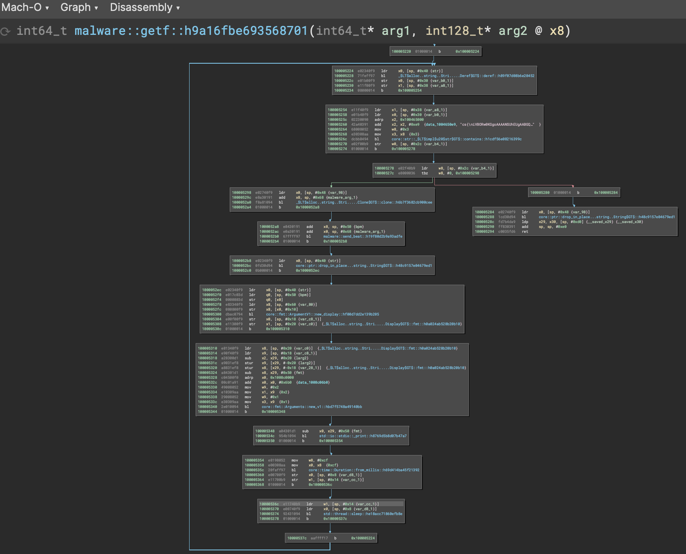
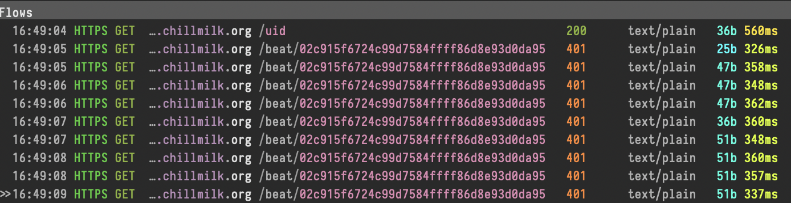

# Chillnet

## Investigation

Running the downloaded version reveals a couple key details:
1. The connection is presumably assigned a unique UUID
1. The process begins with a calibration period to establish a BPM
1. The process logs a calculated BPM, in this case around 95 BPM, which is
"too slow"

```bash
❯❯  ./chillnet_macos_aarch64_original
UID ACQUIRED: 05bb35d30d7551bda403942d1a6c77145169
STARTING SEQUENCE...
that was your first beat!
keep it up! need more beats for BPM calculation
keep it up! need more beats for BPM calculation
keep it up! need more beats for BPM calculation
You are too slow! Perceived BPM: 123.71130615001786
You are too slow! Perceived BPM: 120.96772937571353
You are too slow! Perceived BPM: 123.45683518353086
You are too slow! Perceived BPM: 115.16311532912052
```

This is enough information to begin orienting reverse engineering. The goals of
reversing include:

1. Establishing who or what is calculating the BPM
1. Figuring out how to modify the BPM to test faster values
1. Understand any specifics about the server connection in case modification of
transferred data is required to pass the checks required

## Binary Reverse Engineering

*The follow section reverses the Mach-O ARM binary, though the general reversing
principles are relevant to any architecture*

Opening in Binary Ninja quickly reveals the binary is compiled Rust; functions
such as `___rust_alloc` are a key indicator. `_main` quickly calls
`malware::main::h156d824968118820`, which is where the majority of the
functionality resides. The first anchor point is determining where looping
occurs - presumably there is a `loop` which runs until some condition is met.
Locating this code in the `malware::getf::h9a16fbe693568701`
 that continues until the return value of the
call to `core::str::_$LT$impl$u20$str$GT$::contains::h1cdf56e08216399c` returns
nonzero. One of the arguments to `contain` starts with the string `cs{`, so
presumably this routine continues until the process receives a string containing
the flag. The return value (the return from a `String` related function) is
immediately used for `display` and `fmt` functions in `malware::main::...`, so
presumably the flag is logged to console. So, the next goal is how to retrieve
the flag.

Since there is limited user control in this binary, it is likely the flag is
retrieved from a server and not located in the binary itself. Scanning the loop
shows a call to `malware::send_beat::h19f80d2b9a93adfe`, which sounds promising
given the BPM output from running the binary. The function calls a lot of
formatting and string functions, but then later uses `reqwest::blocking::get`
which is a [crate for HTTP requests](https://docs.rs/reqwest/latest/reqwest/
index.html). This likely indicates communication with some server to pass a flag
check. The sequence of calls:

1. `reqwest::blocking::get`
1. `core::result::Result::...::unwrap`
1. `reqwest::blocking::response::Response`

Look very similar to [an example in the `reqwest` documentation](https://
docs.rs/reqwest/latest/reqwest/blocking/struct.Response.html#examples). This
is very likely a HTTP GET request, checking for a valid response, and returning
the response to `malware::getf::...`. The following function calls involve
`String`, `display`, and `fmt` calls followed by `std::io::stdio::_print`. This
means the process is formatting a string and logging it (likely to `stdout`).
If this assumption is correct, the client (binary) is not performing any BPM
calculations. Rather, it is sending a GET request (with content currently
unknown) to the server and then logging its response to console. The lag between
console logs is due to the final two function calls in the loop:
`core::time::Duration::from_millis` and `std::thread::sleep`. This is a common
sequence for sequence of operations [to make a rust process sleep](https://
doc.rust-lang.org/std/thread/fn.sleep.html#examples).

Given this challenge appears to analyze BPM (beats per minute) and there is a
process sleep of X milliseconds, presumably the sleep needs to be adjusted to
a satisfactory value. The sleep duration is the first argument to
`core::time::Duration::from_millis` (using the Rust documentation), and the
disassembly shows that this is 0xc8, or 200 ms.

```
100005354  08198052   mov     w8, #200
100005358  e00308aa   mov     x0, x8  {200}
10000535c  20faff97   bl      core::time::Duration::from_millis::h69d414ba45f21392
100005360  e00700f9   str     x0, [sp, #0x8 {var_d8_1}]
100005364  e11700b9   str     w1, [sp, #0x14 {var_cc_1}]
100005368  01000014   b       0x10000536c
```

So, adjusting this value should change the BPM response from the server because
it adjusts the frequency at which the GET request function is called. This
theory is most easily tested by patching the binary. Binary Ninja can do this
easily by . Entering 150 changes the relevant `mov`
instruction bytes from 08198052 to c8128052.

```
100005354  c8128052   mov     w8, #0x96
100005358  e00308aa   mov     x0, x8  {0x96}
10000535c  20faff97   bl      core::time::Duration::from_millis::h69d414ba45f21392
100005360  e00700f9   str     x0, [sp, #0x8 {var_d8_1}]
100005364  e11700b9   str     w1, [sp, #0x14 {var_cc_1}]
100005368  01000014   b       0x10000536c
```

Patching the binary can also be done manually at the byte level, however that
requires understanding of the `mov` ARM instruction (this will differ for
`x86_64`). The easiest way to do this is to bring up an ARM assembler ([this one
is perfect](https://shell-storm.org/online/Online-Assembler-and-Disassembler/),
just select the `aarch64` architecture), and write the new assembly instruction.

For instance, inputting `mov w8, #150` outputs `"\xc8\x12\x80\x52"` for little-
endian. This shows the first type bytes of the instruction changed, and they can
be patched at the byte level.

Running with a few different immediate values shows that there is a desirable
BPM around 125-130 BPM:

```
150ms --> 135BPM
100ms --> 160BPM
You are just right! Keep it up! Perceived BPM: 125.78616402498548
...
You are just right! Keep it up! Perceived BPM: 130.1518535106492
```

### Codesigning

Note that patching the binary changes as outlined above changes the code section
within the binary, thus invalidating the current binary's signature. Trying to
run a patched binary will result in the following output:

```bash
❯❯  ./chillnet_macos_aarch64_patch
zsh: killed     ./chillnet_macos_aarch64_patch
```

That is not particularly helpful, so further details can be retrieved from the
Console app in Crash Reports:

```
-------------------------------------
Translated Report (Full Report Below)
-------------------------------------

Process:               chillnet_macos_aarch64_patch [62630]
Path:                  /Users/USER/Documents/*/chillnet_macos_aarch64_patch
Identifier:            chillnet_macos_aarch64_patch
Version:               ???
Code Type:             ARM-64 (Native)
Parent Process:        zsh [50592]
Responsible:           Terminal [3446]
User ID:               501

Date/Time:             2023-12-31 11:23:56.9053 -0600
OS Version:            macOS 13.4.1 (22F82)
Report Version:        12
Anonymous UUID:        E2767147-847A-ADEB-7F6A-0EE124266E34

Sleep/Wake UUID:       2663B5F9-D234-4837-AA65-69CF8D99212A

Time Awake Since Boot: 600000 seconds
Time Since Wake:       3220 seconds

System Integrity Protection: enabled

Crashed Thread:        0  Dispatch queue: com.apple.main-thread

Exception Type:        EXC_BAD_ACCESS (SIGKILL (Code Signature Invalid))
Exception Codes:       UNKNOWN_0x32 at 0x000000010065165c
Exception Codes:       0x0000000000000032, 0x000000010065165c
```

As shown above, the process was automatically killed, not by `zsh`, but rather
the OS due to the invalid code signature. Since the challenge creator created
and signed the binary, updating the signature is not viable without the cert
on-hand. An easy workaround is just to run the binary in lldb, which bypasses
signature checks for the spawned subprocess. Otherwise, resign the binary as
follows. First, create a new self-signed code signing cert using
Keychain Access -> Certificate Assistant -> Create a Certificate with the name
'MyCert', Identity Type 'Self-Signed Root' and type 'Code Signing'. Then:

```bash
# remove the current signature
codesign --remove-signature ./chillnet_macos_aarch64_patch
# verify the signature was removed
codesign -dv --verbose=4 ./chillnet_macos_aarch64_patch
    ./chillnet_macos_aarch64_patch_2: code object is not signed at all
# sign the binary using the self-signed MyCert cert
codesign --timestamp --options=runtime -s "MyCert" ./chillnet_macos_aarch64_patch
# verify the new signature was applied using MyCert
codesign -dv --verbose=4 ./chillnet_macos_aarch64_patch_2
    Executable=/Users/comedian/Documents/git/CTF-Writeups/misc/chillnet/chillnet_macos_aarch64_patch
    Identifier=chillnet_macos_aarch64_patch
    Format=Mach-O thin (arm64)
    CodeDirectory v=20500 size=120767 flags=0x10000(runtime) hashes=3768+2 location=embedded
    VersionPlatform=1
    VersionMin=917504
    VersionSDK=917504
    Hash type=sha256 size=32
    CandidateCDHash sha256=9c0c9388283f0dbfcc4fdb77bb211bd2b3b69acc
    CandidateCDHashFull sha256=9c0c9388283f0dbfcc4fdb77bb211bd2b3b69accad94ab668fea2faddfed63e7
    Hash choices=sha256
    CMSDigest=9c0c9388283f0dbfcc4fdb77bb211bd2b3b69accad94ab668fea2faddfed63e7
    CMSDigestType=2
    Executable Segment base=0
    Executable Segment limit=9175040
    Executable Segment flags=0x1
    Page size=4096
    Launch Constraints:
            None
    CDHash=9c0c9388283f0dbfcc4fdb77bb211bd2b3b69acc
    Signature size=5953
    Authority=MyCert
    Timestamp=Dec 31, 2023 at 11:40:25
    Info.plist=not bound
    TeamIdentifier=not set
    Runtime Version=14.0.0
    Sealed Resources=none
    Internal requirements count=1 size=108
# run the binary now that it is signed
./chillnet_macos_aarch64_patch
    UID ACQUIRED: 93569f4ac40c7171d5f3bf3e96cf060b96cc
    STARTING SEQUENCE...
```

The `sign.sh` script can be used to remove and resign the binary once the MyCert
cert is created.

### Lag

It should be noted that internet lag will certainly affect these
calculations, as the server is likely maintaining a timer between the last
received packet and the next. Round Trip Timing (RTT) between packets will
clearly influence BPM. For this example, a BPM of 125 would expect a packet
every ~480 ms. Internet lag is therefore around ~430 ms, which is substantial.

Continuing the tweak the sleep results in four sequential BPMs within the
required range, and the server responds with the flag!

## Protocol Reverse Engineering

Another alternative to solving the challenge with no binary reversing is to
reverse the client-server communication and replicate the required interaction.

Following [this guide](https://earthly.dev/blog/mitmproxy/), HTTP and HTTPS
traffic can be routed through a proxy to decrypt any key exchange and retrieve
payload data. Running the binary with proxied traffic, `mitmproxy` shows a
connection to `https://c2.chillmilk.org`, which seems like the likely traffic.



The protocol can be summarized as the following:

1. The client connects to endpoint `/uid` with a GET request and receives back
a unique identifier (e.g., `02c915f6724c99d7584ffff86d8e93d0da95`)
1. The client sends a GET request to `/beat/{uid}` and receives back a response
with body text such as `You are too slow! Perceived BPM: {bpm}`.

This is a fairly simple protocol and can easily replicated. The solution is
written in Rust as a nod to the challenge binary. The code is in the `client`
crate, but is summarized here since it is brief:

```rust
// ./client/src/main.rs

use reqwest;
use std::{thread, time};

async fn get_uid(endpoint: &str) -> Result<String, reqwest::Error> {
    let mut url = "https://c2.chillmilk.org/".to_string();
    url.push_str(endpoint);
    let text = reqwest::get(url)
        .await?
        .text()
        .await?;

    Ok(text)
}

async fn send_beat(uid: &String) -> Result<String, reqwest::Error> {
    let mut url = "https://c2.chillmilk.org/beat/".to_string();
    url.push_str(uid);
    let text = reqwest::get(url)
        .await?
        .text()
        .await?;

    Ok(text)
}

#[tokio::main]
async fn main() {
    let uid = get_uid("uid").await.expect("Failed to get UUID");
    println!("got uid = {uid}");
    let mut ms = 55;
    loop {
        let resp = send_beat(&uid).await.expect("Failed to send beat");
        println!("{resp}");
        if resp.contains("CS{") { break; }
        if resp.starts_with("You are too slow!") { ms -= 1; }
        else if resp.starts_with("You are too fast!") { ms += 1; }

        let sleep_time = time::Duration::from_millis(ms);
        thread::sleep(sleep_time);
    }
}
```

The code is self-modifying to try and calculate the BPM dynamically given
feedback from the server. It could also be constructed with a console pause to
let the user tap out a BPM to solve. Running the code and letting the network
settle into the required BPM solves the challenge as well.
